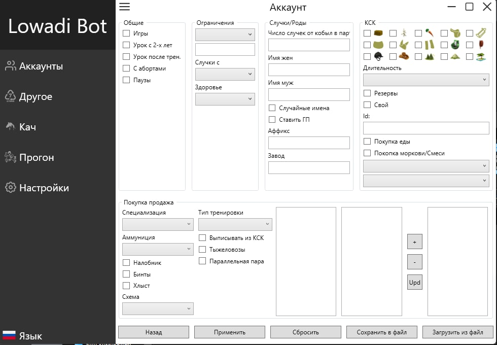

# LowadiBot

## Image

## Bot for game:

- [Lowadi](https://www.lowadi.com/)
- [Howrse](https://www.howrse.com/)

## Function
1. Localization (Russian/English);
2. The ability to specify the game server;
3. Adding multiple accounts, specifying a proxy
4. Pumping horses
5. Running horses
6. Various additional functionality